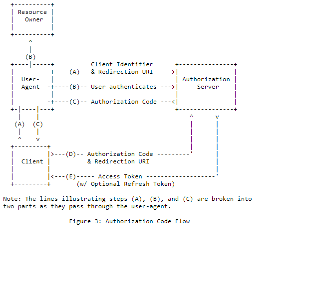

# Class 15
## What is OAuth

### What is OAuth?
is an open-standard authorization protocol or framework that describes how unrelated servers and services can safely allow authenticated access to their assets without actually sharing the initial, related, single logon credential
### Give an example of what using OAuth would look like.
Google Gmail and Microsoft OneDrive
### How does OAuth work? What are the steps that it takes to authenticate the user?
1. The first website connects to the second website on behalf of the user, using OAuth, providing the user’s verified identity.
2. The second site generates a one-time token and a one-time secret unique to the transaction and parties involved.
3. The first site gives this token and secret to the initiating user’s client software.
4. The client’s software presents the request token and secret to their authorization provider (which may or may not be the second site).
5. If not already authenticated to the authorization provider, the client may be asked to authenticate. After authentication, the client is asked to approve the authorization transaction to the second website.
6. The user approves (or their software silently approves) a particular transaction type at the first website.
7. The user is given an approved access token (notice it’s no longer a request token).
8. The user gives the approved access token to the first website.
9. The first website gives the access token to the second website as proof of authentication on behalf of the user.
10. The second website lets the first website access their site on behalf of the user.
11. The user sees a successfully completed transaction occurring.
12. OAuth is not the first authentication/authorization system to work this way on behalf of the end-use
### What is OpenID?

for humans logging into machines, OAuth is for machines logging into machines on behalf of humans
---
## Authorization and Authentication flows

### What is the difference between authorization and authentication?
authenticationGenerally, transmits info through an ID Token
authorization Generally, transmits info through an Access Token
### What is Authorization Code Flow?

### What is Authorization Code Flow with Proof Key for Code Exchange (PKCE)?
reduces security risks for native apps, as embedded secrets aren’t required in source code, which limits exposure to reverse engineering.
### What is Implicit Flow with Form Post?
uses OIDC to implement web sign-in that is very similar to the way SAML and WS-Federation operates. The web app requests and obtains tokens through the front channel, without the need for secrets or extra backend calls.
### What is Client Credentials Flow?
 permissions are granted directly to the application itself by an administrator. When the app presents a token to a resource, the resource enforces that the app itself has authorization to perform an action since there is no user involved in the authentication.
### What is Device Authorization Flow?
This avoids a poor user experience for devices that do not have an easy way to enter text.
### What is Resource Owner Password Flow?