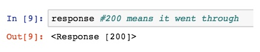
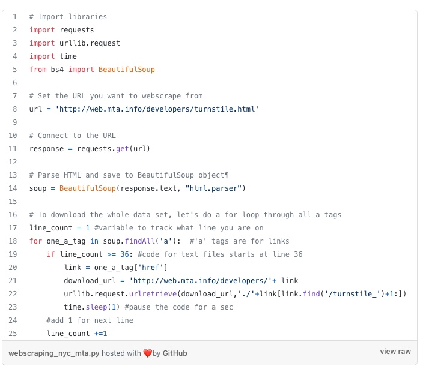

# class 14
## Web Scraping

Web scraping is a technique to automatically access and extract large amounts of information from a website, which can save a huge amount of time and effort.

Important notes about web scraping:

Read through the website’s Terms and Conditions to understand how you can legally use the data. Most sites prohibit you from using the data for commercial purposes.

Make sure you are not downloading data at too rapid a rate because this may break the website. You may potentially be blocked from the site as well.

We start by importing the following libraries.

import requests import urllib.request import time from bs4 import BeautifulSoup

Next, we set the url to the website and access the site with our requests library.

url = <your URL>

response = requests.get(url)
If the access was successful, you should see the following output:

Next we parse the html with BeautifulSoup so that we can work with a nicer, nested BeautifulSoup data structur

soup = BeautifulSoup(response.text, “html.parser”)

Next we parse the html with BeautifulSoup so that we can work with a nicer, nested BeautifulSoup data structure.

soup.findAll('a')

Next, let’s extract the actual link that we want.

one_a_tag = soup.findAll(‘a’)[38] link = one_a_tag[‘href’]

we should include this line of code so that we can pause our code for a second so that we are not spamming the website with requests. This helps us avoid getting flagged as a spammer.

