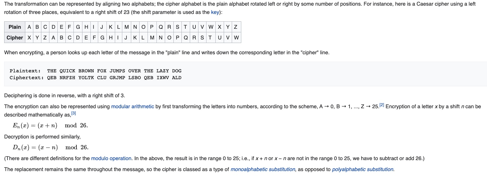

# class 16
### Encrypting a message
Imagine Caesar wants to send this message: SECRET MEETING AT THE PALACE

Here's what that might look like encrypted: YKIXKZ SKKZOTM GZ ZNK VGRGIK

That looks an awfully lot like gobbledygook at first, but this encrypted message is actually very related to the original text.

The Caesar Cipher is a simple substitution cipher which replaces each original letter with a different letter in the alphabet by shifting the alphabet by a certain amount

### Decrypting a message
According to historical records, Caesar always used a shift of 3. As long as his message recipient knew the shift amount, it was trivial for them to decode the message.

### Cracking the cipher
Imagine that a very literate and savvy enemy intercepts one of Caesar's messages.

RZ VMZ WMDIBDIB VGG AJMXZN OJ EJDI RDOC XGZJKVOMV OJ YZAZVO OCZ ZIZHT LPZZI VO OCZ IDGZ YZGOV

That enemy does not know that Caesar always uses a shift of 3, so he must attempt to "crack" the cipher without knowing the shift.

There are three main techniques he could use: frequency analysis, known plaintext, and brute force.

### Frequency analysis
Human languages tend to use some letters more than others. For example, "E" is the most popular letter in the English language. We can analyze the frequency of the characters in the message and identify the most likely "E" and narrow down the possible shift amounts based on that.

### Ceasar Cipher

In cryptography, a Caesar cipher, also known as Caesar's cipher, the shift cipher, Caesar's code or Caesar shift, is one of the simplest and most widely known encryption techniques. It is a type of substitution cipher in which each letter in the plaintext is replaced by a letter some fixed number of positions down the alphabet. For example, with a left shift of 3, D would be replaced by A, E would become B, and so on. The method is named after Julius Caesar, who used it in his private correspondence.

The Caesar cipher can be easily broken even in a ciphertext-only scenario. Two situations can be considered:

1. an attacker knows (or guesses) that some sort of simple substitution cipher has been used, but not specifically that it is a Caesar scheme;
2. an attacker knows that a Caesar cipher is in use, but does not know the shift value.