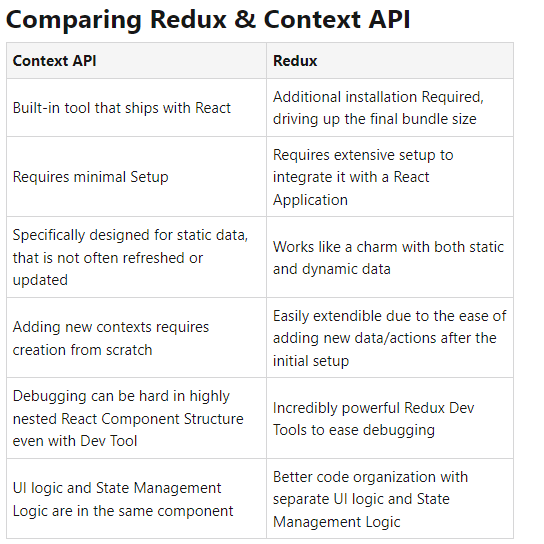

# Class 34
## Context API

### What is Global State
In React, originally, the state is held and modified within the same React component. In most applications, different components may need to access and update the same state. This is achieved by introducing the global states in your app. The main purpose of the global state is to share a state among multiple components.

There are three ways this communication can happen:

With a child component
With a parent component
With a sibling component

### Context API in React
Context provides a way to pass data through the component tree without having to pass props down manually at every level.

In a typical React application, data is passed top-down (parent to child) via props, but such usage can be cumbersome for certain types of props (e.g. locale preference, UI theme) that are required by many components within an application. Context provides a way to share values like these between components without having to explicitly pass a prop through every level of the tree.

### Context API vs Redux JS

From the table, you must be able to comprehend where the popular opinion Redux is for large projects & Context API for small ones come from.

Both are excellent tools for their own specific niche, Redux is overkill just to pass data from parent to child & Context API truly shines in this case. When you have a lot of dynamic data Redux got your back!